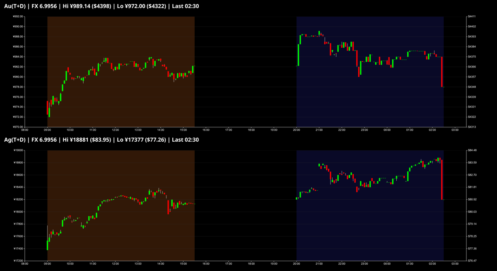

# Shanghai Gold & Silver Charts

Real-time charting application for Shanghai Gold Exchange (SGE) precious metals prices with live WebSocket updates and interactive candlestick charts.



## Features

- **Real-time Data**: Fetches Au(T+D) and Ag(T+D) prices from Shanghai Gold Exchange
- **Live Charts**: Interactive candlestick charts with session highlighting
- **Dual Currency**: Shows prices in both CNY and USD with live FX conversion
- **Trading Sessions**: Visual indicators for day (09:00-15:30) and night (20:00-02:30) sessions
- **WebSocket Streaming**: Live price updates without page refresh

## Architecture

```
collector.py → SQLite DB → websocket_metals.py → WebSocket → client.js → Canvas Charts
```

## Quick Start

### Prerequisites

- Python 3.8+
- Optional: Alpha Vantage API key for USD/CNY exchange rates

### Installation

```bash
# Install Python dependencies
pip install pytz requests websockets

# Set API key (optional)
export ALPHA_VANTAGE_API_KEY="your_key_here"
```

### Running

```bash
# Start data collector (fetches SGE prices every minute)
python3 collector.py

# Start WebSocket server (serves data to frontend)
python3 websocket_metals.py

# Open browser to http://localhost:8000
```

## Components

### Backend

#### `collector.py`
- Fetches real-time prices from SGE API every 60 seconds
- Stores data in SQLite with Shanghai timezone handling
- Manages USD/CNY exchange rates via Alpha Vantage API
- Handles trading session logic and data validation

#### `websocket_metals.py`
- WebSocket server on port 8001
- HTTP server on port 8000 for static files
- Broadcasts price updates to connected clients
- Serves last 36 hours of data on connection

### Frontend

#### `client.js`
- Main application entry point
- Connects to WebSocket and manages chart updates
- Creates separate charts for gold and silver

#### `chart_canvas.js` - `CandleChart` class
- Canvas-based candlestick chart renderer
- Automatic session windowing (shows last 2 sessions)
- Dual-axis display (CNY left, USD right)
- Session highlighting and grid overlay

#### `candles.js`
- Converts tick data to OHLC candlesticks
- 5-minute interval bucketing
- Shanghai timezone alignment

#### `price_stream.js` - `PriceStream` class
- WebSocket client wrapper
- Event-based data handling
- Automatic reconnection

#### Supporting modules
- `sessions.js`: Trading session visualization
- `time_shanghai.js`: Shanghai timezone utilities
- `axis_fmt.js`: Chart axis formatting
- `consts.js`: Application constants

## Configuration

### Environment Variables

- `SHANGHAI_DB`: SQLite database path (default: `shanghai_metals.db`)
- `ALPHA_VANTAGE_API_KEY`: For USD/CNY exchange rates (optional)

### Chart Options

```javascript
const chart = new CandleChart("container-id", {
  title: "Chart Title",
  metal: "gold",        // "gold" | "silver"
  unit: "CNY/g",        // "CNY/g" | "CNY/kg"
  margin: { top: 20, right: 120, bottom: 30, left: 90 },
  window: {
    sessions: 2,        // Number of sessions to display
    day: { start: [9, 0], end: [15, 30] },
    night: { start: [20, 0], end: [2, 30] }
  }
});
```

## Data Format

### Database Schema
```sql
CREATE TABLE prices (
  metal TEXT NOT NULL,           -- "gold" | "silver"
  timestamp TEXT NOT NULL,       -- ISO8601 with +08:00
  price_cny REAL NOT NULL,       -- Price in CNY
  usd_cny_rate REAL,            -- USD/CNY exchange rate
  PRIMARY KEY (metal, timestamp)
);
```

### WebSocket Message
```json
{
  "gold": [
    {
      "timestamp": "2025-12-30T14:30:00+08:00",
      "price_cny": 612.50,
      "usd_cny_rate": 7.2456
    }
  ],
  "silver": [...]
}
```

## Trading Sessions

- **Day Session**: 09:00 - 15:30 Shanghai time
- **Night Session**: 20:00 - 02:30 Shanghai time (next day)
- **Break**: 02:30 - 09:00 and 15:30 - 20:00

## Development

### Nix Development Environment

```bash
nix develop
```

### File Structure

```
├── collector.py           # SGE data collector
├── websocket_metals.py    # WebSocket server
├── client.js             # Main frontend app
├── chart_canvas.js       # Canvas chart renderer
├── candles.js            # OHLC data processing
├── price_stream.js       # WebSocket client
├── sessions.js           # Session visualization
├── time_shanghai.js      # Timezone utilities
├── axis_fmt.js           # Chart formatting
├── consts.js             # Constants
├── index.html            # Web interface
└── flake.nix             # Nix development setup
```

## API Limits

- Alpha Vantage: 25 requests/day (free tier)
- SGE: No documented limits, fetches every 60 seconds

## License

MIT
